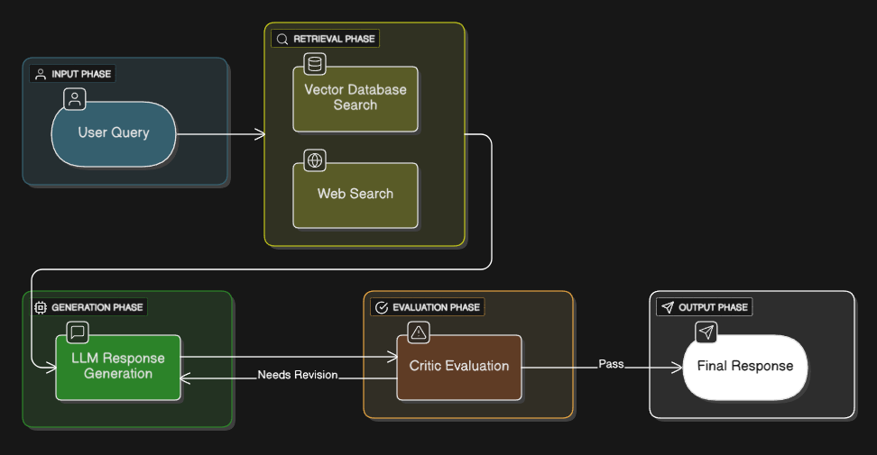

# Medical AI Assistant

A comprehensive medical information system that combines vector database retrieval with real-time web search to provide accurate, evidence-based medical responses. The system uses an LLM pipeline architecture with quality evaluation and multi-source information synthesis.

## Features

- **Hybrid Information Retrieval**: Combines local medical knowledge base with real-time web search
- **LLM Pipeline Architecture**: Vector DB → Web Search → Response Generation → Quality Evaluation
- **Quality Assurance**: Built-in critic agent evaluates response quality and suggests improvements
- **Medical Document Processing**: Processes PDF medical literature with intelligent chunking
- **Real-time Web Search**: Fetches current medical information from trusted sources
- **Interactive Web Interface**: Modern, responsive chat interface with source citations
- **Session Management**: Maintains conversation history and chat sessions

## Architecture



### Components

1. **Document Processing** (`utils/read_preprocess.py`)
   - PDF text extraction and cleaning
   - Medical document preprocessing

2. **Text Chunking** (`utils/chunk_data.py`)
   - Intelligent document segmentation
   - Overlap management for context preservation

3. **Vector Database** (`utils/qdrant_db.py`)
   - Qdrant integration for semantic search
   - Embedding storage and retrieval

4. **Embeddings** (`utils/embeddings.py`)
   - Cohere API integration for text embeddings
   - Rate limiting and error handling

5. **LLM Agent** (`utils/retrieval_qa.py`)
   - Groq API integration for response generation
   - Context synthesis from multiple sources

6. **Web Scraper** (`utils/tavily.py`)
   - Real-time medical information retrieval
   - Trusted medical source filtering

7. **Critic Agent** (`utils/critic_agent.py`)
   - Response quality evaluation
   - Improvement suggestions

## Installation

### Prerequisites

- Python 3.8+ or (3.10) - suggested
- API keys for required services should be stored in .env file

### Setup

1. **Clone the repository**
   ```bash
   git clone https://github.com/akakran22/Medical-ChatBot-Pro.git
   cd Medical-ChatBot-Pro
   ```

2. **Create virtual environment**
   ```bash
   python -m venv venv
   source venv/bin/activate  # On Windows: venv\Scripts\activate
   ```

3. **Install dependencies**
   ```bash
   pip install -r requirements.txt
   ```

4. **Set up environment variables**
   Create a `.env` file in the root directory:
   ```env
   # API Keys
   QDRANT_URL=your_qdrant_cluster_url
   QDRANT_API_KEY=your_qdrant_api_key
   QDRANT_COLLECTION_NAME=Medical
   GROQ_API_KEY=your_groq_api_key
   COHERE_API_KEY=your_cohere_api_key
   TAVILY_API_KEY=your_tavily_api_key
   
   # Flask Configuration
   FLASK_SECRET_KEY=your_secret_key_here
   FLASK_DEBUG=False
   PORT=5000
   ```

5. **Add medical documents**
   Place your PDF medical documents in the `data/` folder:
   ```
   data/
   ├── Standard_Treatment_Guidelines.pdf
   └── The_Gale_Encyclopedia_Of_Medicine.pdf
   ```

## Configuration

### Required API Keys

1. **Qdrant Cloud** - Vector database hosting
   - Sign up at [Qdrant Cloud](https://cloud.qdrant.io/)
   - Create a cluster and get URL + API key

2. **Cohere** - Text embeddings
   - Sign up at [Cohere](https://dashboard.cohere.ai/)
   - Get API key (free tier available)

3. **Groq** - LLM inference
   - Sign up at [Groq](https://console.groq.com/)
   - Get API key for Llama model access

4. **Tavily** - Web search
   - Sign up at [Tavily](https://tavily.com/)
   - Get API key for web search functionality

### Project Structure

```
medical-ai-assistant/
├── app.py                 # Main Flask application
├── data/                  # Medical PDF documents
├── utils/                 # Core utilities
│   ├── read_preprocess.py # Document processing
│   ├── chunk_data.py      # Text chunking
│   ├── embeddings.py      # Cohere embeddings
│   ├── qdrant_db.py       # Vector database operations
│   ├── retrieval_qa.py    # LLM response generation
│   ├── tavily.py          # Web search integration
│   └── critic_agent.py    # Response quality evaluation
├── templates/
│   └── chat.html          # Web interface
├── static/
│   └── styles.css         # Styling
├── requirements.txt       # Dependencies
├── .env                   # Environment variables
└── README.md             # This file
```

## Usage

### Starting the Application

```bash
python app.py
```

The application will:
1. Check for required environment variables
2. Initialize the vector database
3. Process PDF documents (first run only)
4. Start the Flask web server on `http://localhost:5000`

### First Run

On the first run, the system will:
- Load and process PDF documents from the `data/` folder
- Generate embeddings for document chunks
- Store embeddings in the Qdrant vector database
- This process may take several minutes depending on document size

### Using the Interface

1. Open `http://localhost:5000` in your browser
2. Type medical questions in the chat interface
3. Receive comprehensive responses with source citations
4. View response quality scores and processing analytics
5. Access conversation history in the sidebar

### Example Queries

- "What are the symptoms of high blood pressure?"
- "How does diabetes affect the body?"
- "What are the treatment options for asthma?"
- "Explain the side effects of aspirin"

## API Endpoints

- `GET /` - Main chat interface
- `POST /chat` - Process medical queries
- `GET /clear_history` - Clear chat history
- `GET /status` - System health check

## Technical Details

### Pipeline Flow

1. **Query Processing**: User submits medical question
2. **Vector Search**: Semantic search through medical documents
3. **Web Search**: Real-time search of trusted medical websites
4. **Context Synthesis**: Combine information from both sources
5. **Response Generation**: LLM generates comprehensive answer
6. **Quality Evaluation**: Critic agent scores response quality
7. **Iterative Improvement**: Additional searches if quality is low

### Rate Limiting

The system includes built-in rate limiting for API calls:
- Cohere: 10 documents per batch, 2-second delays
- Automatic retry logic with exponential backoff
- Graceful degradation with dummy embeddings on failure

### Medical Disclaimers

All responses include appropriate medical disclaimers and encourage consultation with healthcare professionals.

## Troubleshooting

### Common Issues

1. **Dimension Mismatch Error**
   - Delete the Qdrant collection and restart
   - The system will recreate with correct dimensions

2. **Rate Limit Exceeded**
   - Wait for rate limits to reset
   - Consider upgrading API plans for higher limits

3. **PDF Processing Errors**
   - Ensure PDFs are readable and not password-protected
   - Check file paths in `utils/read_preprocess.py`

4. **Missing Dependencies**
   - Run `pip install -r requirements.txt` again
   - Check Python version compatibility

### Logs and Debugging

The application provides detailed console output for:
- Document processing status
- Embedding generation progress
- Database operations
- Query processing steps
- Error messages with context

## Dependencies

Core dependencies include:
- Flask 2.3.3 - Web framework
- qdrant-client 1.7.0 - Vector database client
- cohere - Text embeddings API
- groq 0.4.1 - LLM inference API
- tavily-python 0.3.0 - Web search API
- langchain-community 0.0.10 - Document processing
- numpy 1.24.3 - Numerical computing
- requests 2.31.0 - HTTP requests

See `requirements.txt` for complete dependency list.

## Disclaimer

This medical AI assistant is for informational and educational purposes only. It should not be used as a substitute for professional medical advice, diagnosis, or treatment. Always consult with qualified healthcare providers for medical concerns.

